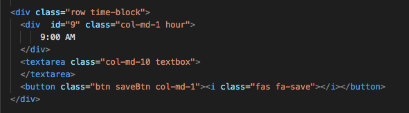
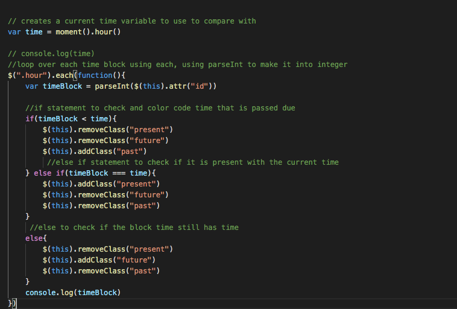

# work-day-scheduler

## Summary:
This project is more than creating a workday schedule, it has allowed me to utilize APIs such as; bootstrap and jquery to create a project in an efficient timely manner. The use of Bootstrap allowed me to create columns quickly, and JQuery simplified my logic significantly. Also, The Moment.js framework was key in creating this project because it gave me access to their framework's variables, thus allowinng me to manipulate it with JQuery. 

## Steps:
1. Inserted all appropriate CDN links to allow my code to have access with Jquery, Bootstrap, and Google Fonts.

2. Quickly Created my time slots divs utilizing bootstraps rows and columns as shown in screenshot bellow:
    
    

    This allowed me to create the time slots alot more quickly than using native CSS.

3. The styling was pre-written; therefore, I jumped right into Jquery. First I declared my variables above using the $() selector. I defined my dates such as the currentTime as = to moment(); and the time variable = to moment().hour(). After this, I was able to compare my timeBlocks with the current time of the hour and assign color coding using .removeClass and .addClass. Here is the screenshot with pseudo coding showing the process of that:

    

    This allowed me to take each() time slot with the class starting with      ".hour" - convert them into integers, and compare them to the curren time (using the 24 hour clock) using if and else statements.

4.  Lastly, for saving it into the local storage, I assigned the save buttons with a variable of saveTask, and created an .on("click", function). Here is a screenshot of that part of the script: 
    
    

    The .siblings() function was important because it allowed me to reference the siblings of the save button's elements (the textbox and hours). This allowed me to set them into the localStorage. I was then able to display the notification of when the user saves a schedule by using the .css() function. I then used the setTimeout function to clear it out to make the notification 'disappear' after two seconds.

## Conclusion:
This challenge was much needed for any developer to take on. It will give them the right exposure of just how great API's are in delivering convenience to their project. It also illustrates how important API's are in providing efficiency. 

## Links
Here are some links to some resources that have helped me create this project:

https://stackoverflow.com/questions/34625764/moment-js-dynamically-update-time-in-seconds
https://getbootstrap.com/docs/4.0/layout/grid/
https://www.w3schools.com/jquery/traversing_siblings.asp

